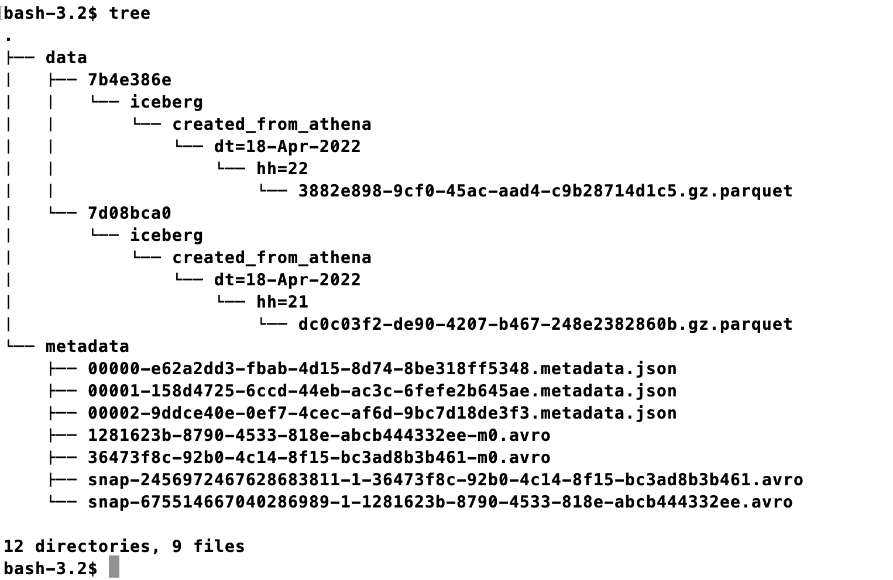

# From Athena
## Create Table
```sql
CREATE TABLE iceberg.created_from_athena (
  id int,
  name string,
  dt string, 
  hh string )
PARTITIONED BY (dt,hh)
LOCATION 's3://athena-workshop-18042022/athena/iceberg/created_from_athena'
TBLPROPERTIES (
  'table_type'='iceberg',
  'format'='parquet',
  'write_target_data_file_size_bytes'='536870912'
);

```
### Folder Structure After Create


### Metadata File Content 
`metadata/00000-e62a2dd3-fbab-4d15-8d74-8be318ff5348.metadata.json`

```json    
    {
      "format-version" : 2,
      "table-uuid" : "3d3c98a6-e35d-4842-9bc1-17752a4a557d",
      "location" : "s3://athena-workshop-18042022/athena/iceberg/created_from_athena",
      "last-sequence-number" : 0,
      "last-updated-ms" : 1650297852223,
      "last-column-id" : 4,
      "current-schema-id" : 0,
      "schemas" : [ {
        "type" : "struct",
        "schema-id" : 0,
        "fields" : [ {
          "id" : 1,
          "name" : "id",
          "required" : false,
          "type" : "int"
        }, {
          "id" : 2,
          "name" : "name",
          "required" : false,
          "type" : "string"
        }, {
          "id" : 3,
          "name" : "dt",
          "required" : false,
          "type" : "string"
        }, {
          "id" : 4,
          "name" : "hh",
          "required" : false,
          "type" : "string"
        } ]
      } ],
      "default-spec-id" : 0,
      "partition-specs" : [ {
        "spec-id" : 0,
        "fields" : [ {
          "name" : "dt",
          "transform" : "identity",
          "source-id" : 3,
          "field-id" : 1000
        }, {
          "name" : "hh",
          "transform" : "identity",
          "source-id" : 4,
          "field-id" : 1001
        } ]
      } ],
      "last-partition-id" : 1001,
      "default-sort-order-id" : 0,
      "sort-orders" : [ {
        "order-id" : 0,
        "fields" : [ ]
      } ],
      "properties" : {
        "write.format.default" : "parquet",
        "write.target-file-size-bytes" : "536870912",
        "write.object-storage.enabled" : "true",
        "write.object-storage.path" : "s3://athena-workshop-18042022/athena/iceberg/created_from_athena/data"
      },
      "current-snapshot-id" : -1,
      "snapshots" : [ ],
      "snapshot-log" : [ ],
      "metadata-log" : [ ]
    }
```


## Insert Data to Table
```sql
INSERT into "iceberg"."created_from_athena" values ( 1, 'First Rec From Athena' , '18-Apr-2022','21')

SELECT * FROM "iceberg"."created_from_athena" limit 10;

```

### Folder Structure After Insert


### Metadata File Content
#### Metadata Json
`metadata/00001-158d4725-6ccd-44eb-ac3c-6fefe2b645ae.metadata.json`

```json
{
  "format-version" : 2,
  "table-uuid" : "3d3c98a6-e35d-4842-9bc1-17752a4a557d",
  "location" : "s3://athena-workshop-18042022/athena/iceberg/created_from_athena",
  "last-sequence-number" : 1,
  "last-updated-ms" : 1650298351436,
  "last-column-id" : 4,
  "current-schema-id" : 0,
  "schemas" : [],
  "default-spec-id" : 0,
  "partition-specs" : [],
  "last-partition-id" : 1001,
  "default-sort-order-id" : 0,
  "sort-orders" : [ {
    "order-id" : 0,
    "fields" : [ ]
  } ],
  "properties" : {},
  "current-snapshot-id" : 675514667040286989,
  "snapshots" : [ {
    "sequence-number" : 1,
    "snapshot-id" : 675514667040286989,
    "timestamp-ms" : 1650298351436,
    "summary" : {
      "operation" : "append",
      "added-data-files" : "1",
      "added-records" : "1",
      "added-files-size" : "635",
      "changed-partition-count" : "1",
      "total-records" : "1",
      "total-files-size" : "635",
      "total-data-files" : "1",
      "total-delete-files" : "0",
      "total-position-deletes" : "0",
      "total-equality-deletes" : "0"
    },
    "manifest-list" : "s3://athena-workshop-18042022/athena/iceberg/created_from_athena/metadata/snap-675514667040286989-1-1281623b-8790-4533-818e-abcb444332ee.avro",
    "schema-id" : 0
  } ],
  "snapshot-log" : [ {
    "timestamp-ms" : 1650298351436,
    "snapshot-id" : 675514667040286989
  } ],
  "metadata-log" : [ {
    "timestamp-ms" : 1650297852223,
    "metadata-file" : "s3://athena-workshop-18042022/athena/iceberg/created_from_athena/metadata/00000-e62a2dd3-fbab-4d15-8d74-8be318ff5348.metadata.json"
  } ]
}
```
#### Menefest List File
`metadata/snap-675514667040286989-1-1281623b-8790-4533-818e-abcb444332ee.avro`

```json
{
    "manifest_path" : "s3://athena-workshop-18042022/athena/iceberg/created_from_athena/metadata/1281623b-8790-4533-818e-abcb444332ee-m0.avro",
    "manifest_length" : 7086,
    "partition_spec_id" : 0,
    "content" : 0,
    "sequence_number" : 1,
    "min_sequence_number" : 1,
    "added_snapshot_id" : 675514667040287000,
    "added_data_files_count" : 1,
    "existing_data_files_count" : 0,
    "deleted_data_files_count" : 0,
    "added_rows_count" : 1,
    "existing_rows_count" : 0,
    "deleted_rows_count" : 0,
    "partitions" : [
        {
            "contains_null" : false,
            "contains_nan" : false,
            "lower_bound" : "MTgtQXByLTIwMjI=", -- 18-Apr-2022
            "upper_bound" : "MTgtQXByLTIwMjI=" --18-Apr-2022
        },
        {
            "contains_null" : false,
            "contains_nan" : false,
            "lower_bound" : "MjE=", ## 21
            "upper_bound" : "MjE=" ## 21
        }
    ]
}
```
#### Menefest File
`metadata/1281623b-8790-4533-818e-abcb444332ee-m0.avro`
```json
{
    "status" : 1,
    "snapshot_id" : 675514667040287000,
    "sequence_number" : null,
    "data_file" : {
        "content" : 0,
        "file_path" : "s3://athena-workshop-18042022/athena/iceberg/created_from_athena/data/7d08bca0/iceberg/created_from_athena/dt=18-Apr-2022/hh=21/dc0c03f2-de90-4207-b467-248e2382860b.gz.parquet",
        "file_format" : "PARQUET",
        "partition" : {
            "dt" : "18-Apr-2022",
            "hh" : "21"
        },
        "record_count" : 1,
        "file_size_in_bytes" : 635,
        "column_sizes" : [
            {
                "key" : 1,
                "value" : 49
            },
            {
                "key" : 2,
                "value" : 73
            },
            {
                "key" : 3,
                "value" : 63
            },
            {
                "key" : 4,
                "value" : 54
            }
        ],
        "value_counts" : [
            {
                "key" : 1,
                "value" : 1
            },
            {
                "key" : 2,
                "value" : 1
            },
            {
                "key" : 3,
                "value" : 1
            },
            {
                "key" : 4,
                "value" : 1
            }
        ],
        "null_value_counts" : [
            {
                "key" : 1,
                "value" : 0
            },
            {
                "key" : 2,
                "value" : 0
            },
            {
                "key" : 3,
                "value" : 0
            },
            {
                "key" : 4,
                "value" : 0
            }
        ],
        "nan_value_counts" : [
        ],
        "lower_bounds" : [
            {
                "key" : 1,
                "value" : "AQAAAA=="
            },
            {
                "key" : 2,
                "value" : "Rmlyc3QgUmVjIEZyb20gQQ==" --First Rec From A
            },
            {
                "key" : 3,
                "value" : "MTgtQXByLTIwMjI=" --18-Apr-2022 
            },
            {
                "key" : 4,
                "value" : "MjE="
            }
        ],
        "upper_bounds" : [
            {
                "key" : 1,
                "value" : "AQAAAA=="
            },
            {
                "key" : 2,
                "value" : "Rmlyc3QgUmVjIEZyb20gQg==" --First Rec From B
            },
            {
                "key" : 3,
                "value" : "MTgtQXByLTIwMjI="
            },
            {
                "key" : 4,
                "value" : "MjE="
            }
        ],
        "key_metadata" : null,
        "split_offsets" : null,
        "equality_ids" : null,
        "sort_order_id" : 0
    }
}

```

### Folder Structure After Another Insert


## EMR Cluster Creation for Spark SQL
`EMR Version:6.3.0`
```shell
aws emr create-cluster --termination-protected \
--applications Name=Hadoop Name=Hive Name=Pig Name=Spark Name=Livy \
--ec2-attributes '{"KeyName":"aksh-useast","InstanceProfile":"EMR_EC2_DefaultRole","SubnetId":"subnet-008996dc434a75398","EmrManagedSlaveSecurityGroup":"sg-0293acdd6212519b7","EmrManagedMasterSecurityGroup":"sg-09713a8bf849b4b3e"}' \
--release-label emr-6.3.0 \
--log-uri 's3n://aws-logs-799223504601-us-east-1/elasticmapreduce/' \
--instance-groups '[{"InstanceCount":1,"EbsConfiguration":{"EbsBlockDeviceConfigs":[{"VolumeSpecification":{"SizeInGB":64,"VolumeType":"gp2"},"VolumesPerInstance":4}]},"InstanceGroupType":"MASTER","InstanceType":"m5.4xlarge","Name":"Master - 1"}]' \
--configurations '[{"Classification":"hive-site","Properties":{"hive.metastore.client.factory.class":"com.amazonaws.glue.catalog.metastore.AWSGlueDataCatalogHiveClientFactory"}},{"Classification":"spark-hive-site","Properties":{"hive.metastore.client.factory.class":"com.amazonaws.glue.catalog.metastore.AWSGlueDataCatalogHiveClientFactory"}}]' \
--auto-scaling-role EMR_AutoScaling_DefaultRole \
--ebs-root-volume-size 100 \
--service-role EMR_DefaultRole \
--enable-debugging --name 'iceberg' \
--scale-down-behavior TERMINATE_AT_TASK_COMPLETION \
--region us-east-1
```
## Spark SQL Insert and Query Data
```shell

spark-sql \
    --conf spark.sql.extensions=org.apache.iceberg.spark.extensions.IcebergSparkSessionExtensions    \
    --conf spark.sql.catalog.my_catalog=org.apache.iceberg.spark.SparkCatalog    \
    --conf spark.sql.catalog.my_catalog.warehouse=s3://athena-workshop-18042022/athena/iceberg \
    --conf spark.sql.catalog.my_catalog.catalog-impl=org.apache.iceberg.aws.glue.GlueCatalog \
    --conf spark.sql.catalog.my_catalog.io-impl=org.apache.iceberg.aws.s3.S3FileIO \
    --packages org.apache.iceberg:iceberg-spark3-runtime:0.12.1,org.apache.iceberg:iceberg-spark3-extensions:0.12.1,org.apache.spark:spark-streaming-kinesis-asl_2.12:3.1.1,com.qubole.spark:spark-sql-kinesis_2.12:1.2.0_spark-3.0,software.amazon.awssdk:bundle:2.15.40,software.amazon.awssdk:url-connection-client:2.15.40

```
```roomsql
select * from my_catalog.iceberg.created_from_athena ;

INSERT into my_catalog.iceberg.created_from_athena values ( 3, 'Third Rec From Spark' , '18-Apr-2022','23')
```

## From Athena Query , Delete , Update data
```shell
delete from "iceberg"."created_from_athena" where id=3 ;
SELECT * FROM "iceberg"."created_from_athena" limit 10;
```
## From Spark SQL Query , Delete , Update data
```roomsql
select * from my_catalog.iceberg.created_from_athena ;

DELETE from my_catalog.iceberg.created_from_athena where id=1 ;

select * from my_catalog.iceberg.created_from_athena ;

update my_catalog.iceberg.created_from_athena set name='Second Rec From Athena Updated From Spark' where id=2

```

## From Spark SQL Create Table
```roomsql
  CREATE TABLE my_catalog.iceberg.created_from_spark (
            id int,
            name string,
            dt string, 
            hh string )
 PARTITIONED BY (dt,hh)
 LOCATION 's3://athena-workshop-18042022/athena/iceberg/created_from_spark'
 TBLPROPERTIES (
            'table_type'='iceberg',
            'format'='parquet',
            'write_target_data_file_size_bytes'='536870912'
);

INSERT into my_catalog.iceberg.created_from_spark values ( 1, 'First Rec From Spark' , '19-Apr-2022','09')

-- For this insert from Athen did not work

```

```roomsql
  CREATE TABLE my_catalog.iceberg.created_from_spark2 (
            id int,
            name string,
            dt string, 
            hh string )
 USING iceberg
 PARTITIONED BY (dt,hh)
 ;

INSERT into my_catalog.iceberg.created_from_spark2 values ( 1, 'First Rec From Spark' , '19-Apr-2022','09')

-- For this insert from Athen did not work

```

