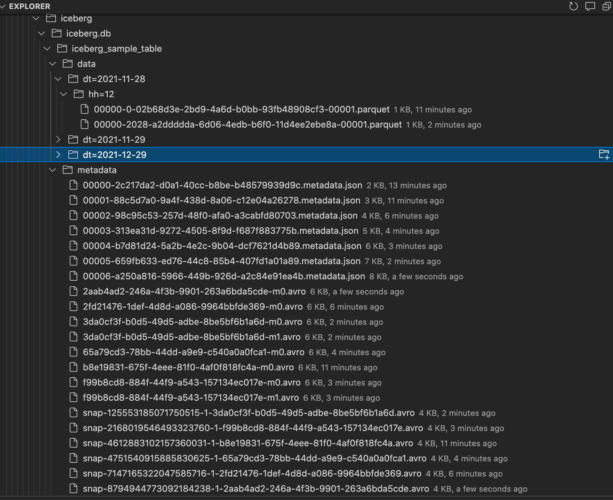

## Spark SQL
```
-- Apache Iceberg
spark-sql \
--packages org.apache.iceberg:iceberg-spark3-runtime:0.12.1,org.apache.iceberg:iceberg-spark3-extensions:0.12.1,\
software.amazon.awssdk:bundle:2.15.40,software.amazon.awssdk:url-connection-client:2.15.40 \
--conf spark.sql.extensions=org.apache.iceberg.spark.extensions.IcebergSparkSessionExtensions    \
--conf spark.sql.catalog.my_catalog=org.apache.iceberg.spark.SparkCatalog    \
--conf spark.sql.catalog.my_catalog.warehouse=s3://akshaya-firehose-test/lake/compare/iceberg \
--conf spark.sql.catalog.my_catalog.catalog-impl=org.apache.iceberg.aws.glue.GlueCatalog \
--conf spark.sql.catalog.my_catalog.io-impl=org.apache.iceberg.aws.s3.S3FileIO \
--conf spark.sql.catalog.my_catalog.lock-impl=org.apache.iceberg.aws.glue.DynamoLockManager \
--conf spark.sql.catalog.my_catalog.lock.table=myGlueLockTable 


```

## Create Table
```
--Apache Iceberg
create table if not exists my_catalog.iceberg.iceberg_sample_table (
    id bigint,
    name string,
    dt string, 
    hh string 
) using iceberg
partitioned by (dt, hh);
```
### Folder Structure


### Metadata  File 

```json
-- Metadata Content of s3://akshaya-firehose-test/lake/compare/iceberg/iceberg.db/iceberg_sample_table/metadata/00000-2c217da2-d0a1-40cc-b8be-b48579939d9c.metadata.json
{
  "format-version" : 1,
  "table-uuid" : "61baf2f9-7add-4be0-8929-b345c82e5aee",
  "location" : "s3://akshaya-firehose-test/lake/compare/iceberg/iceberg.db/iceberg_sample_table",
  "last-updated-ms" : 1638192725276,
  "last-column-id" : 4,
  "schema" : {
    "type" : "struct",
    "schema-id" : 0,
    "fields" : [ 
        {      "id" : 1,      "name" : "id",      "required" : false,      "type" : "long"      }, 
        {      "id" : 2,      "name" : "name",    "required" : false,      "type" : "string"    }, 
        {      "id" : 3,      "name" : "dt",      "required" : false,      "type" : "string"    }, 
        {      "id" : 4,      "name" : "hh",      "required" : false,      "type" : "string"    } 
    ]
  },
  "current-schema-id" : 0,
  "schemas" : [Schema-List],
  "partition-spec" : [ 
      {    "name" : "dt",    "transform" : "identity",    "source-id" : 3,    "field-id" : 1000  }, 
      {    "name" : "hh",    "transform" : "identity",    "source-id" : 4,    "field-id" : 1001  } 
  ],
  "default-spec-id" : 0,
  "partition-specs" : [],
  "last-partition-id" : 1001,
  "default-sort-order-id" : 0,
  "sort-orders" : [ {    "order-id" : 0,    "fields" : [ ]  } ],
  "properties" : {    "owner" : "hadoop"  },
  "current-snapshot-id" : 8794944773092184238,
  "snapshots" : [ {}, {}, {}, {}, {}, 
          {
            "snapshot-id" : 8794944773092184238,
            "parent-snapshot-id" : 125553185071750515,
            "timestamp-ms" : 1638192725276,
            "summary" : {
              "operation" : "overwrite",
              "spark.app.id" : "application_1638186442430_0007",
              "deleted-data-files" : "1",
              "deleted-records" : "1",
              "removed-files-size" : "1147",
              "changed-partition-count" : "1",
              "total-records" : "2",
              "total-files-size" : "2483",
              "total-data-files" : "2",
              "total-delete-files" : "0",
              "total-position-deletes" : "0",
              "total-equality-deletes" : "0"
            },
            "manifest-list" : "s3://akshaya-firehose-test/lake/compare/iceberg/iceberg.db/iceberg_sample_table/metadata/snap-8794944773092184238-1-2aab4ad2-246a-4f3b-9901-263a6bda5cde.avro",
            "schema-id" : 0
          } 
  ],
  "snapshot-log" : [ {}, {}, {}, {}, {}, {    "timestamp-ms" : 1638192725276,    "snapshot-id" : 8794944773092184238  } ],
  "metadata-log" : [ {}, {}, {}, {}, {}, {    "timestamp-ms" : 1638192660870,    "metadata-file" : "s3://akshaya-firehose-test/lake/compare/iceberg/iceberg.db/iceberg_sample_table/metadata/00005-659fb633-ed76-44c8-85b4-407fd1a01a89.metadata.json"
  } ]
}
```
### Menifest  List File 
```
--- Content of s3://akshaya-firehose-test/lake/compare/iceberg/iceberg.db/iceberg_sample_table/metadata/snap-8794944773092184238-1-2aab4ad2-246a-4f3b-9901-263a6bda5cde.avro
{
   "manifest_path": "s3://akshaya-firehose-test/lake/compare/iceberg/iceberg.db/iceberg_sample_table/metadata/2aab4ad2-246a-4f3b-9901-263a6bda5cde-m0.avro",
   "manifest_length": 6338,
   "partition_spec_id": 0,
   "added_snapshot_id": 8794944773092184238,
   "added_data_files_count": 0,
   "existing_data_files_count": 0,
   "deleted_data_files_count": 1,
   "partitions": [
      {
         "contains_null": false,
         "contains_nan": false,
         "lower_bound": "MjAyMS0xMS0yOA==",
         "upper_bound": "MjAyMS0xMS0yOA=="
      }, 
      {
         "contains_null": false,
         "contains_nan": false,
         "lower_bound": "MTI=",
         "upper_bound": "MTI="
      }
   ],
   "added_rows_count": 0,
   "existing_rows_count": 0,
   "deleted_rows_count": 1
}
{
}
{
}
```
### Menifest  File 
```
--- Content of s3://akshaya-firehose-test/lake/compare/iceberg/iceberg.db/iceberg_sample_table/metadata/2aab4ad2-246a-4f3b-9901-263a6bda5cde-m0.avro

{
   "status": 2,
   "snapshot_id": 8794944773092184238,
   "data_file": 
   {
      "file_path": "s3://akshaya-firehose-test/lake/compare/iceberg/iceberg.db/iceberg_sample_table/data/dt=2021-11-28/hh=12/00000-2028-a2ddddda-6d06-4edb-b6f0-11d4ee2ebe8a-00001.parquet",
      "file_format": "PARQUET",
      "partition":       {         "dt": "2021-11-28",         "hh": "12"      },
      "record_count": 1,
      "file_size_in_bytes": 1147,
      "block_size_in_bytes": 67108864,
      "column_sizes": [    {  "key": 1,  "value": 52 },     
                           {  "key": 2,  "value": 49 }, 
                           {  "key": 3,  "value": 61 },
                           {  "key": 4,  "value": 53 }
                        ],
      "value_counts": [
                        {   "key": 1,   "value": 1     }, 
                        {   "key": 2,   "value": 1     }, 
                        {   "key": 3,   "value": 1     }, 
                        {   "key": 4,   "value": 1     }
                       ],
      "null_value_counts": [
                        {    "key": 1,     "value": 0     }, 
                        {    "key": 2,     "value": 1     }, 
                        {    "key": 3,     "value": 0     }, 
                        {    "key": 4,     "value": 0     }
                    ],
      "nan_value_counts": [
      ],
      "lower_bounds": [
                        {   "key": 1,  "value": "AQAAAAAAAAA="     }, 
                        {   "key": 3,  "value": "MjAyMS0xMS0yOA==" }, 
                        {   "key": 4,  "value": "MTI="             }
      ],
      "upper_bounds": [
                        {    "key": 1,  "value": "AQAAAAAAAAA="       }, 
                        {   "key": 3,  "value": "MjAyMS0xMS0yOA=="    }, 
                        {  "key": 4,  "value": "MTI="                 }
      ],
      "key_metadata": null,
      "split_offsets": [
         4
      ],
      "sort_order_id": 0
   }
}

```


## Insert Data
```
-- Apache Iceberg
insert into my_catalog.iceberg.iceberg_sample_table select 1 as id, 'First', '2021-11-28' as dt, '12' as hh;

insert into my_catalog.iceberg.iceberg_sample_table select 2 as id, 'Second', '2021-11-29' as dt, '12' as hh;

```

## Query Data
```


-- Apache Iceberg
select id, name, dt, hh from  my_catalog.iceberg.iceberg_sample_table where id=1 ;
select * from  my_catalog.iceberg.iceberg_sample_table ;

spark-sql> select id, name, dt, hh from  my_catalog.iceberg.iceberg_sample_table  ;
2	Second	2021-11-29	12
1	First	2021-11-28	12
Time taken: 0.851 seconds, Fetched 2 row(s)

 
```

## Update Merge

```

-- Apache Iceberg
merge into my_catalog.iceberg.iceberg_sample_table as target
using (  select 3 as id, 'Third Merge' as name, '2021-11-29' as dt, '11' hh ) source on target.id = source.id when matched then update set *
when not matched then insert * ;

merge into my_catalog.iceberg.iceberg_sample_table as target
using (  select 2 as id, 'Second Update' as name, '2021-12-29' as dt, '10' hh ) source on target.id = source.id when matched then update set *
when not matched then insert * ;

select * from  my_catalog.iceberg.iceberg_sample_table ;

spark-sql> select * from  my_catalog.iceberg.iceberg_sample_table ;
3	Third Merge	2021-11-29	11
2	Second Update	2021-12-29	10
1	First	2021-11-28	12
Time taken: 2.907 seconds, Fetched 3 row(s)

 
```

## Update Data
```

-- Apache Iceberg
update  my_catalog.iceberg.iceberg_sample_table  set  name = name + 'Updated' where id=1 ;
select * from  my_catalog.iceberg.iceberg_sample_table ;

spark-sql> update  my_catalog.iceberg.iceberg_sample_table  set  name = name + 'Updated' where id=1 ;
Time taken: 9.155 seconds
spark-sql> select * from  my_catalog.iceberg.iceberg_sample_table ;
1	NULL	2021-11-28	12
3	Third Merge	2021-11-29	11
2	Second Update	2021-12-29	10
Time taken: 1.05 seconds, Fetched 3 row(s)


 
```

## Delete data
```


-- Apache Iceberg
delete from  my_catalog.iceberg.iceberg_sample_table  where id=1 ;
select * from  my_catalog.iceberg.iceberg_sample_table ;


spark-sql> select * from  my_catalog.iceberg.iceberg_sample_table ;
3	Third Merge	2021-11-29	11
2	Second Update	2021-12-29	10
Time taken: 0.885 seconds, Fetched 2 row(s)

```
